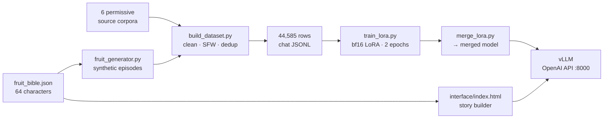

<div align="center">

# 🍑 Fruit-Cheating-LLM

**A specialist language model that writes viral “AI fruit drama” — telenovela episodes where anthropomorphic fruits cheat, scheme, and betray each other.**

Dataset → LoRA fine-tune → served API → point-and-click story builder. The whole pipeline, end to end.

[](https://huggingface.co/Qwen/Qwen3-8B)
[](https://github.com/huggingface/peft)
[](#-the-dataset)
[](#licensing-policy)
[](#-the-fruit-bible)
[](LICENSE)

</div>

---

## What this is

The “AI fruit drama” format is one of the internet's strangest genres: 30-second vertical videos where a strawberry cheats on her husband with an eggplant, a broccoli matriarch rewrites her will, and every episode ends on a cliffhanger. Millions of views. Endlessly repeatable.

This repo turns that format into a **reproducible ML system**:

1. **Build** a 44,585-row instruction dataset of dramatic writing — permissively licensed and platform-safe.
2. **Fine-tune** Qwen3-8B with LoRA so it emits the 6-scene episode format natively.
3. **Serve** it as an OpenAI-compatible API.
4. **Drive** it from a zero-dependency browser UI: pick fruits, set their roles and life-stages, click generate.

Everything here — the character bible, the dataset builder, the trainer, the serving script, the UI — is in this repo.

---

## 🎬 Real output

Generated by the fine-tuned model, from the cast *Broccoli (matriarch) · Eggplant (villain) · Durian (outsider)* and the context *“the reading of the will at the family vineyard.”* Unedited:

```text
EPISODE 2: The Will

Scene — Recap
NARRATION: Last time, a silver-haired broccoli woman sealed a deal that an entire
           family would never forget.
VISUAL: Rainy day in a family office block. A silver-haired broccoli woman in a pearl
        necklace and a power suit. Sealing a document with a fingerprint. Dim, tense.

Scene — Rising Tension
NARRATION: A sleek eggplant man started digging into the matriarch's past, uncovering
           long-buried secrets.
VISUAL: Spreading documents across a desk at night. A sleek eggplant man in a dark
        velvet blazer and a diamond cufflink. Close-up on a fingerprint being lifted.

Scene — Dramatic Peak
NARRATION: 'Dex Durian,' the matriarch said. A sharp-eyed grape woman merely smiled.
VISUAL: Rainy night at a family vineyard estate. A silver-haired broccoli woman in a
        pearl necklace and a sharp-eyed grape woman in blood-red nails, faces inches apart.

Scene — Cliffhanger
NARRATION: The room understood: there was only one way to keep the family whole.
VISUAL: A sharp-eyed grape woman in a charcoal power suit. A slow, knowing half-smile
        in the doorway. Dim amber light, tense atmosphere.
```

Note what the fine-tune actually learned: the **6-scene arc**, the `NARRATION` / `VISUAL` split, the ~85-character voiceover budget, 9:16 staging, and the genre's signature trick — **characters described by appearance and “signature items”** (pearls, blood-red nails, diamond cufflink) so an image model keeps them consistent across scenes.

---

## ⚡ Quickstart

The model runs on a GPU box; the interface runs in your browser.

**Easiest —** double-click [`start-fruit-drama.command`](start-fruit-drama.command). It starts the server, waits for it, and opens the UI.

**Manual —**

```bash
# 1. start the model server on your GPU host
ssh <gpu-host> 'tmux new-session -d -s vs "bash ~/fruit-ft/run_vllm.sh"'

# 2. wait ~2 min, confirm it's live
ssh <gpu-host> 'curl -s localhost:8000/v1/models >/dev/null && echo ready'

# 3. open the story builder
open interface/index.html
```

Then pick a cast, write a context, and hit **▶ Generate episode**.

**Or call the API directly:**

```bash
curl http://<gpu-host>:8000/v1/chat/completions -H "Content-Type: application/json" -d '{
  "model": "fruit",
  "messages": [
    {"role": "system", "content": "<contents of prompts/system_fruit.txt>"},
    {"role": "user", "content": "Write episode 1: a jealous lemon exposes the strawberry’s affair at the broccoli matriarch’s gala."}
  ],
  "chat_template_kwargs": {"enable_thinking": false}
}'
```

> `enable_thinking: false` matters — Qwen3 defaults to emitting a `<think>` block, but this model was trained to answer directly.

---

## 🏗 How it works



### Two-tier training design

The target output (a 6-scene fruit episode) is rare on the open internet, but *dramatic writing* is abundant. So the dataset is split:

| Tier | What it teaches | Rows | System prompt |
|:--|:--|--:|:--|
| **Fruit tier** | The exact output format — 6 scenes, `NARRATION`/`VISUAL`, cliffhangers | 7,500 | [`system_fruit.txt`](prompts/system_fruit.txt) |
| **Voice tier** | Soap-opera voice, escalation, betrayal, shocking twists | 37,085 | [`system_voice.txt`](prompts/system_voice.txt) |

At inference you use the fruit prompt, and the model applies the *dramatic skill* from the voice tier to the *format* from the fruit tier. Every row is prompt-masked (**completion-only loss**), so the model is graded only on what it should generate.

---

## 📊 The dataset

**44,585 rows · 43,694 train / 891 val · ~32.6M tokens · chat-messages JSONL**

```json
{"messages": [
  {"role": "system",    "content": "You are FruitDramaGPT..."},
  {"role": "user",      "content": "Write episode 4 of an AI fruit drama..."},
  {"role": "assistant", "content": "EPISODE 4: The Revenge\n\nScene — Recap\nNARRATION: ..."}],
 "meta": {"source": "...", "slice": "...", "license": "..."}}
```

| Slice | Source | License | Rows |
|:--|:--|:--|--:|
| `writingprompts_twist` | [euclaise/writingprompts](https://huggingface.co/datasets/euclaise/writingprompts) — twist/drama-filtered | MIT | 21,811 |
| `multichar` | [agentlans/multi-character-dialogue](https://huggingface.co/datasets/agentlans/multi-character-dialogue) | CC-BY-4.0 | 12,994 |
| `fruit_synth` | Synthesized from the fruit bible + soap-opera formula | ours | 7,500 |
| `gutenberg_melodrama` | [manu/project_gutenberg](https://huggingface.co/datasets/manu/project_gutenberg) — dramatic excerpts | public domain | 1,181 |
| `dramabench` | [FutureMa/DramaBench](https://huggingface.co/datasets/FutureMa/DramaBench) | MIT | 925 |
| `screenplay_*` | [Atum09/screenplay-dataset](https://huggingface.co/datasets/Atum09/screenplay-dataset) | MIT | 174 |

Every row passes: **detokenization** → **SFW filter** → **quality gate** (length, ASCII ratio, anti-repetition) → **drama-keyword bias** → **global dedup**. Verified: 0 malformed rows, 0 empty completions, **100% unique assistant text within every slice**.

### Licensing policy

Permissive licenses only. This deliberately **excludes** the obvious sources — Cornell Movie-Dialogs, IMSDb, TV-transcript corpora, MELD — because they're copyrighted and unsafe for anything you intend to publish or monetize. The trade-off is real: de-duplicated, permissively-licensed soap dialogue is scarce, which is why the voice tier leans on WritingPrompts and synthetic multi-character dialogue.

> **A finding worth knowing:** `Atum09/screenplay-dataset` looks perfect on paper — MIT, ~1M rows, chat-formatted, genre-tagged. It is also **massively duplicated**: 45,244 drama-genre rows collapse to **174 unique** completions. It contributes 174 rows here, and only because global dedup caught it. Always measure unique yield, not row count.

Rebuild it yourself:

```bash
pip install -r requirements.txt
python src/build_dataset.py                  # full build
python src/build_dataset.py --skip-external  # fruit slice only, fully offline
```

---

## 🍇 The Fruit Bible

64 characters (25 female-dominant · 19 male-dominant · 20 balanced), each with a personality, a **cheating pattern**, physical properties, and — crucially — **four life stages that change who they are**:

| Stage | Biology | Character |
|:--|:--|:--|
| **Growth** | cell expansion, green | insecure, weak, forming |
| **Prime** | maturation, ripe | confident, magnetic, often doing what they once feared |
| **Ripening** | starts to fall | betrayal, exposure, the turn |
| **Senescence** | failure, rot | collapse, regret, downfall |

<details>
<summary><b>Example — 🍌 Banana (“Peter Banana”), male-dominant, <i>The Golden Everyman</i></b></summary>

> **Personality:** Easygoing crowd-pleaser who bends to avoid conflict.
> **Cheating pattern:** Doesn't chase it — slips into an affair because he can't say no.
>
> - **Growth** — Green and stiff: shy, weak, easily overlooked, terrified of standing out.
> - **Prime** — Golden and bulky: confident and magnetic, doing all the reckless things he hated as a kid.
> - **Ripening** — Brown spots spread: friends betray him and his sweetness curdles into self-loathing.
> - **Senescence** — Blackened and mushy: collapses into regret, blaming the bunch that left him.

</details>

Source of truth: [`data/fruit_bible.json`](data/fruit_bible.json) → generates both [`deliverables/Fruit_Drama_Bible.xlsx`](deliverables/Fruit_Drama_Bible.xlsx) (4 sheets, colour-coded by stage) and the browser UI.

---

## 🎛 The story builder

[`interface/index.html`](interface/index.html) — one file, no build step, no dependencies, works offline.

- Click fruits from all 64 (emoji + gender badge, searchable)
- Per character: **gender · life stage · role · disposition · dramatic function · custom note**
- Free-text **context / location / setting**, plus episode number and tone
- **▶ Generate episode** → calls your served model, renders the result inline
- **Copy prompt / Copy JSON** → the assembled `messages` array, for use anywhere

It reads each fruit's *stage-specific* traits from the bible and fuses them with your choices — so a Prime peach and a Senescent peach produce genuinely different characters.

---

## 🧠 Training

| | |
|:--|:--|
| **Base** | `Qwen/Qwen3-8B` (dense, text-only, Apache-2.0) |
| **Method** | bf16 LoRA — no quantization, no bitsandbytes, no offload |
| **LoRA** | `r=16`, `alpha=32`, `dropout=0.05`, targets `q_proj,k_proj,v_proj,o_proj` |
| **Trainable** | 15,335,424 / 8,206,070,784 params = **0.19%** |
| **Schedule** | 2 epochs · 5,462 steps · lr `1e-4` cosine · 3% warmup · grad-clip 1.0 |
| **Batching** | seq len 2048 · per-device 1 × grad-accum 16 · gradient checkpointing |
| **Loss** | completion-only (prompt tokens masked to `-100`) |
| **Hardware** | NVIDIA DGX Spark — GB10, aarch64, CUDA 13, 121 GB unified memory |
| **Cost** | ~12.7 s/step → **~22 h wall clock**, **21.6 GB peak** of 121 GB |

```bash
python training/train_lora.py --smoke                                  # load + 1 step, verify
python training/train_lora.py --model Qwen/Qwen3-8B --epochs 2         # full run
python training/merge_lora.py                                          # fold LoRA into base
tmux new-session -d -s vs "bash training/run_vllm.sh"                  # serve on :8000
```

Run long jobs under `tmux` — the trainer checkpoints every 200 steps and keeps the last 3, so any checkpoint is a usable adapter.

---

## 🔧 Engineering notes

The things that actually cost time. Written down so they don't cost yours.

<details>
<summary><b>A 35B MoE would not fine-tune on 121 GB of unified memory — even in 4-bit</b></summary>

The original target was Qwen3.6-35B-A3B (a multimodal MoE) — the same model the box was already *serving* happily at ~91 GB under vLLM. Training was a different story:

- HF's loader **materializes full bf16 weights during load regardless of the 4-bit target**, so QLoRA didn't shrink the load peak at all. Both bf16 and 4-bit climbed past the 121 GB ceiling and were OOM-killed at ~50% loaded.
- On **unified memory** there's no separate VRAM pool to absorb that spike, and the box has no spare swap — twice it thrashed unresponsive for minutes until the kernel reaped the process.
- `transformers` 5.2.0 was additionally pathological on this architecture: ~12–18 s *per parameter*, a projected 3–5 h load. Upgrading to 5.14.1 fixed the speed and the instant doubling — but not the ceiling.
- `device_map="auto"` + `max_memory` + NVMe `offload_folder` did not cap it either.

**Lesson:** inference memory is a bad predictor of training memory, and a novel architecture's *loader* can be the binding constraint long before the math is. Pivoting to a dense 8B model turned a multi-day fight into a 1.5-minute load and a clean run. The trainer keeps the 4-bit/offload paths for boxes where they help.

</details>

<details>
<summary><b>vLLM fails at startup with <code>FileNotFoundError: 'ninja'</code></b></summary>

vLLM JIT-compiles kernels during engine init and needs `ninja` on `PATH` — with *or without* `--enable-lora`. The traceback surfaces as `Engine core initialization failed`, which is not obviously about a missing build tool.

```bash
<vllm-env>/bin/pip install ninja
export PATH=<vllm-env>/bin:$PATH   # before `vllm serve`
```

</details>

<details>
<summary><b>Qwen3 emits a <code>&lt;think&gt;</code> block unless you turn it off</b></summary>

Thinking mode is the default. The model here was trained on non-thinking targets, so serve-time requests must pass:

```json
{"chat_template_kwargs": {"enable_thinking": false}}
```

Without it you get a paragraph of reasoning before the episode, and the format drifts. The same flag is used at tokenization time in `train_lora.py`.

</details>

<details>
<summary><b>Serve a merged model, not a LoRA adapter</b></summary>

`--enable-lora` pulls in punica JIT kernels — extra surface area to break on non-standard hardware. Merging the adapter into the base (`merge_lora.py`) produces an ordinary 16 GB model directory that vLLM serves like anything else. Simpler, faster at inference, no adapter-rank flags.

</details>

<details>
<summary><b>Smaller traps</b></summary>

- `apply_chat_template(tokenize=True)` returns a `tokenizers.Encoding`, which **Arrow cannot serialize** — `datasets.map` dies with a confusing `OverflowError`. Render to text first, then tokenize.
- Reddit-sourced text can contain **lone UTF-16 surrogates** that crash `json.dumps` on write. Sanitize with `.encode('utf-8','ignore').decode('utf-8','ignore')`.
- HF row-by-row streaming ran at ~4 rows/s here. Bulk-downloading parquet shards and parsing locally with `pyarrow` was orders of magnitude faster.
- `pkill -f infer.py` over SSH **matches the SSH command's own shell** and kills your session (exit 255). Target a PID, or use `tmux`.

</details>

---

## 📁 Repo layout

```
config/mix.json              slice caps, filters, licenses
prompts/system_*.txt         fruit + voice system prompts
data/fruit_bible.json        64 characters × 4 life stages  (source of truth)
data/samples/sample.jsonl    30-row peek at the training data
deliverables/                Fruit_Drama_Bible.xlsx
interface/index.html         story builder UI (single file, offline)
start-fruit-drama.command    double-click launcher (macOS)

src/build_dataset.py         orchestrator: dedup → shuffle → split → data card
src/adapters.py              per-source → unified chat rows
src/filters.py               cleaning · SFW · quality · dedup
src/fruit_generator.py       synthetic 6-scene episode generator
src/augment_dataset.py       add a source without rebuilding from scratch
src/measure.py               measure real *unique* yield per source
src/build_bible_xlsx.py      fruit_bible.json → Excel
src/build_interface.py       fruit_bible.json → interface/index.html

training/train_lora.py       LoRA SFT (bf16 default; 4-bit + offload optional)
training/merge_lora.py       fold adapter into base for serving
training/infer.py            offline generation smoke test
training/run_vllm.sh         serve merged model, OpenAI-compatible :8000
```

The 133 MB training JSONL and model weights are **not** committed — rebuild with `src/build_dataset.py`, or publish them to the Hugging Face Hub.

---

## ⚖️ License & use

Code in this repo is **MIT** — see [`LICENSE`](LICENSE). The dataset is built exclusively from MIT / CC-BY-4.0 / public-domain sources plus original synthetic data, and is SFW-filtered — see [`data/dataset_card.json`](data/dataset_card.json) for the per-license breakdown of any build.

Attribution obligations flow through: the `multichar` slice is **CC-BY-4.0**, so credit [agentlans/multi-character-dialogue](https://huggingface.co/datasets/agentlans/multi-character-dialogue) if you redistribute the dataset or a model trained on it.

This produces fiction about produce. It is designed for short-form entertainment — outputs are melodrama, not advice, and the genre trades in betrayal and infidelity by construction.

---

<div align="center">
<sub>Built with Claude Code · trained on an NVIDIA DGX Spark</sub>
</div>
